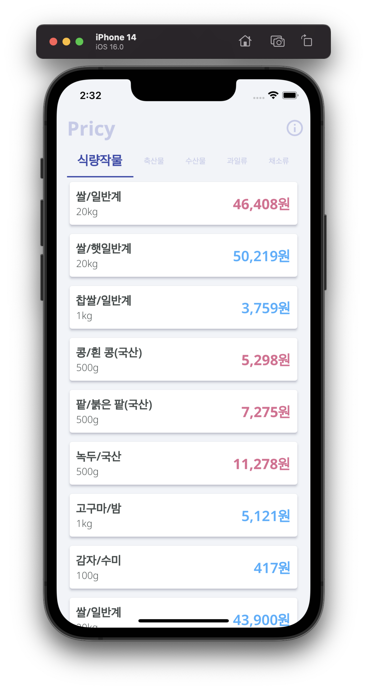
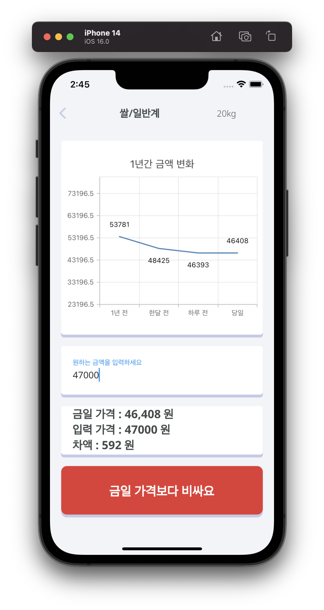
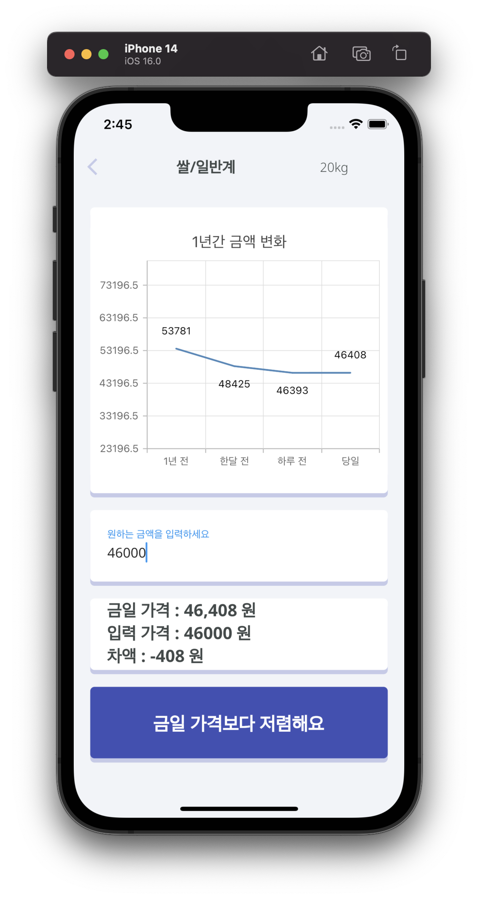
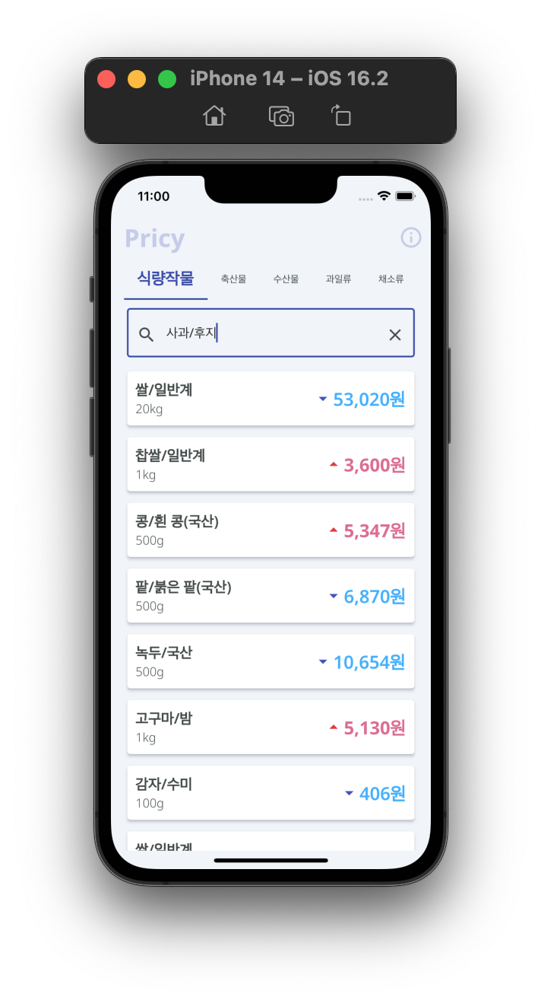

# Pricy


## Team members
- hyunryeol Park | [[github]](https://github.com/devpark435)
- yujin kim | [[github]](https://github.com/yujinkim1)
- jinwoo Lee | [[github]](https://github.com/yeeZinu)

## Old Features
<details>
<summary><h3>1.0.0</h3></summary>
<div markdown="1">
<p align="center">



</p>
</div>
</details>

## New Features
<p align="center">

</p>

## Requirements
### 1. Create `~/.env`

```bash
$ cd ~/pricy-flutter-app | touch .env
```
### 2. Insert the KAMIS certificate keys

```bash
#must be type to string
key = "your key" #required
id = "your id" #required
```
### 3. Run & Debug

```bash
$ pwd | cd ~/pricy-flutter-app
$ flutter run
```

## [Update history](.github/HISTORY.md)
> 링크를 통해 프로젝트의 이전 기록을 확인할 수 있습니다.

## Contributor
<p align="center">
    <a href="https://www.kamis.or.kr/customer/main/main.do">
        
    </a>
</p>